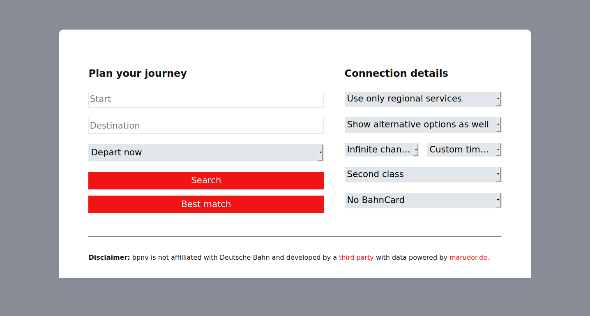

# bpnv

"Barrierefreier Personennahverkehr" (bpnv) will be one of the few routing apps for the German public transportation network that puts user experience above everything else. It will try to give as much information on your journey as possible while being completely platform agnostic. 

The software will be especially tuned to support the needs of nonvisual passengers by incorporating truly accessible instructions to get around in unfamiliar locations. This will be done in ways such as verbose text to speech Maps-like navigation, a very clean user interface and even information about other services that are related to those that you need for your trip. 

Current public transit apps are often hard to use and show data in a very visual way, and lack certain functionality that would be beneficial to the nonvisual users this project caters towards. 

If you would like to help with this project, feel free to get in touch with me. I am currently still planning this out and would appreciate any feedback from potential users.

Yours truly,

a very dissappointed user of any of the available public transit apps.

## Preview

 